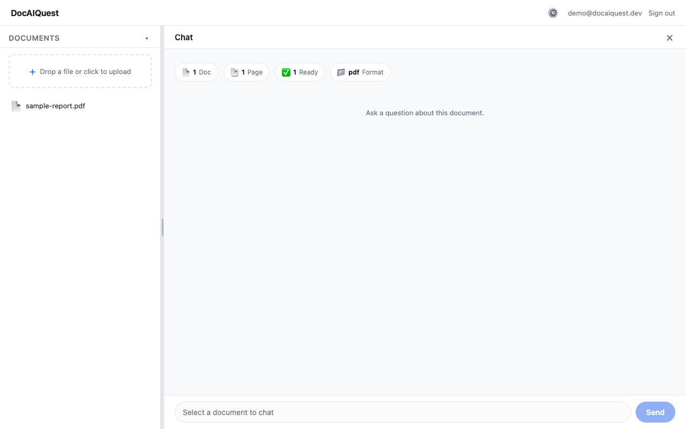
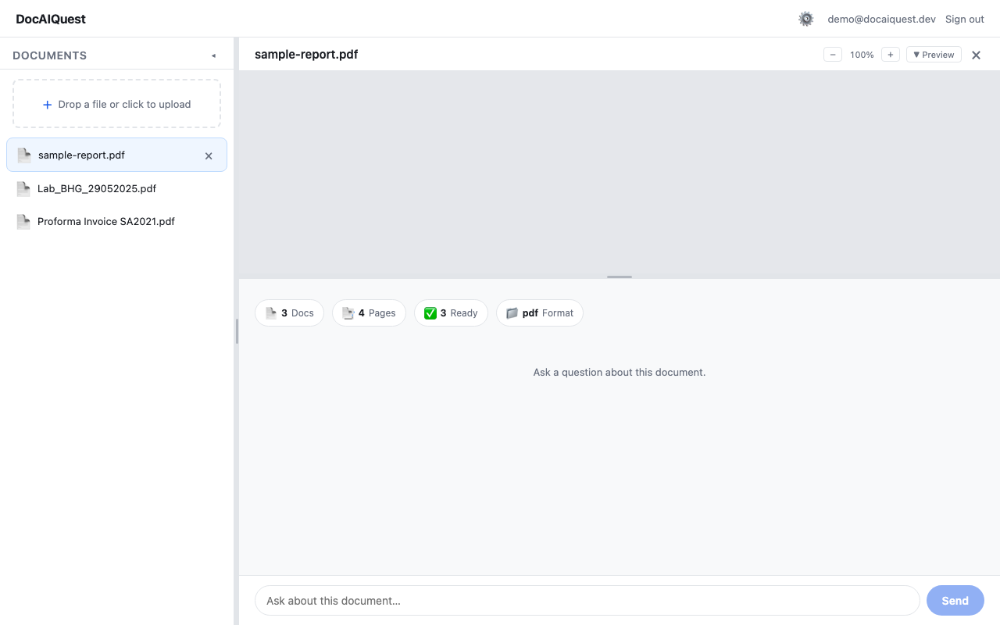
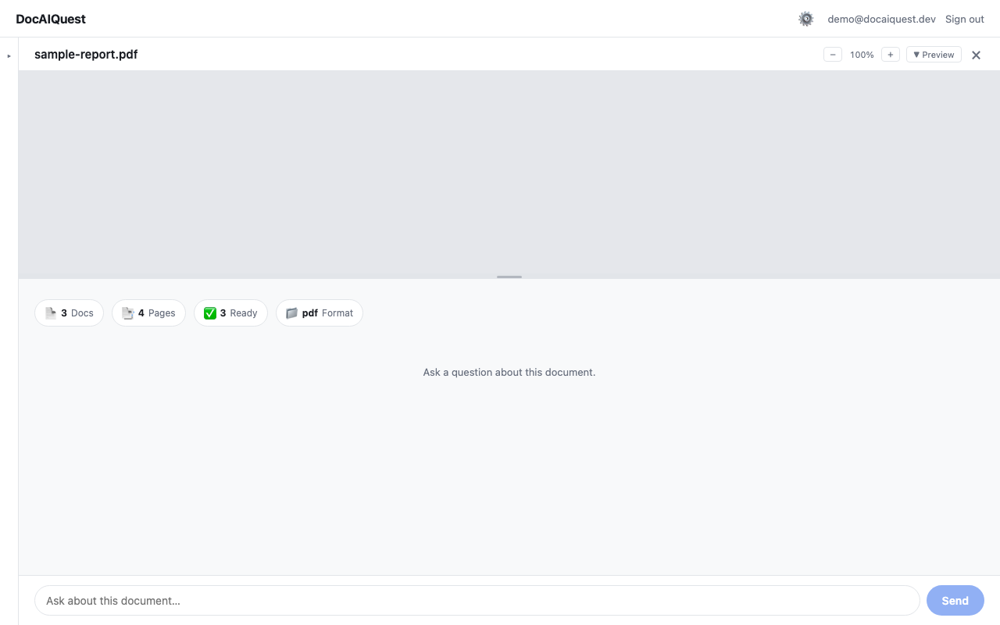
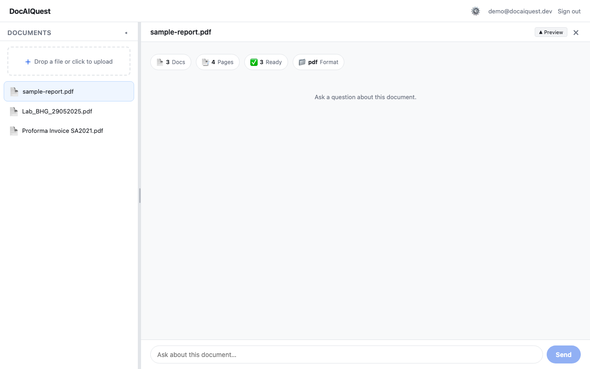

## DocAIQ

**Self-hosted or Cloud-Subscription Document Intelligence Engine.** 
Documents → Data → Intel.

Upload any document and chat with your data — all through a browser.
Privacy-native. 
BYO LLM keys.
MIT licensed.


Opensource #DocAIQuest
Cloud Advance model #DocAIQ cloud


> **Document parsing · chunking · embeddings · hybrid RAG (BM25 + vector) ·
> cross-document chat · Docker self-hosted**

[](LICENSE)
[](https://www.python.org/)
[](https://docs.docker.com/compose/)
[](https://github.com/rbgoda/docaiquest/discussions)

> **You need your own LLM provider key.** DocAIQuest OSS does not ship with
> managed LLM access.
> Set at least one of `DASHSCOPE_API_KEY` (recommended),
> `OPENAI_API_KEY`, `ANTHROPIC_API_KEY`, `GEMINI_API_KEY`, `DEEPSEEK_API_KEY`,
> or `OPENROUTER_API_KEY` in your `.env` file before starting.
> Without a key, parsing and chunking work — but extraction and chat won't.


## DocAIQ Cloud


For teams that need more than self-hosted RAG, **DocAIQ Cloud** ([docaiq.jicama.tech](https://docaiq.jicama.tech)) layers
proprietary intelligence on top of the open-source engine: a **tool-using ReAct agent** that searches,
cross-references, and validates across documents; **multi-pass extraction** with row-level reconciliation
for statements and invoices; an **AI Schema Architect** that reads a document and proposes the optimal
extraction schema; a **personal watchlist** that tracks renewals, expiries, and deadlines with calendar
reminders; and a **reflexion learning loop** where every 👍/👎 improves future answers — all with
managed LLM access, Google Drive auto-sync, and per-document cost analytics.

##DocAIQuest Console

<p align="center">
  
  
  
  
</p>

## Capabilities

DocAIQuest is a **self-hosted web console** — upload documents and chat with them. 
Your own LLM keys, your own server, your data never leaves.

**Pipeline:** Upload → Parse → Chunk → Embed → Store → Retrieve → Generate answer.

### Document Parsing

| Format | Detail |
|--------|--------|
| PDF (text) | Layout preservation, table extraction |
| PDF (scanned/OCR) | External vision models |
| DOCX / PPTX | Native parsers with embedded-image OCR support |
| XLSX / CSV / TSV | Structured table extraction |
| Images (PNG, JPG, HEIC, AVIF) | Vision model OCR |
| EML (email) | Headers, body, and attachment extraction |
| TXT / Markdown | Encoding detection |

### Chunking & Embedding

| Capability | Detail |
|-----------|------------|
| Chunking | Block-aware + semantic chunking, configurable overlap windows |
| Embedding backends | Local (free, CPU), DashScope, OpenAI, Gemini — bring your own key |

### Retrieval

| Capability | Detail |
|-----------|------------|
| Hybrid retrieval | BM25 keyword + vector similarity, fused with Reciprocal Rank Fusion |
| Graph retrieval | Entity graph traversal across documents |
| Citations | Per-sentence source citations with in-page jump links |
| Abstention | Refuses to answer when evidence is insufficient |

### Chat & Query

| Capability | Detail |
|-----------|------------|
| Single-document chat | RAG with citations — ask questions about one document |
| Cross-document chat | Ask across all your documents at once |
| Multi-turn conversations | Follow-up questions with full conversation history |

### Privacy & Security

| Capability | Detail |
|-----------|------------|
| Data residency | All data stays in your own database and file storage |
| No telemetry | Zero outbound calls beyond the LLM providers you configure |
| Per-user isolation | Each user sees only their own documents |

### Frontend & UX

| Capability | Detail |
|-----------|------------|
| Document viewer | Raw file preview with zoom controls |
| Chat panel | Split-pane with source citations |
| Responsive | Mobile-friendly across all views |

### Deployment

| Capability | Detail |
|-----------|------------|
| Deploy | `docker compose up` — single command |
| Stack | PostgreSQL (pgvector) + Redis + MinIO + FastAPI + React |
| Requirements | 4 GB RAM minimum, 8 GB recommended; ~10 GB disk |
| Configuration | Single `.env` file |
| Platform | Linux, macOS (Docker); ARM64 and AMD64 |

## Quick start

### Prerequisites

- **Docker** + Docker Compose v2
- **git** and **make**
- **4 GB RAM** minimum / **8 GB** recommended
- **~10 GB** free disk space (Docker images + database + file storage)
- **An LLM provider key** — you bring your own

## Layout

```
├── backend/           FastAPI application (package: `app`)
│   ├── app/
│   │   ├── agents/    Extraction, OCR, chat agents
│   │   ├── routers/   API endpoints
│   │   ├── services/  Business logic (chat pipeline, workspace)
│   │   ├── llm/       LLM gateway, prompts, routing
│   │   ├── graph/     Entity resolution & knowledge graph
│   │   └── jobs/      Background cron jobs
│   └── migrations/    Alembic (auto-run on boot)
├── frontend/          Web console (Vite + React SPA)
└── docker-compose.yml
```


### 1. Deploy

```bash
git clone https://github.com/rbgoda/docaiquest.git && cd docaiquest
cp .env.example .env
```

Now edit `.env` — the two **required** settings:

```ini
DOCAIQ_JWT_SECRET=<any random string, e.g. output of `openssl rand -hex 32`>
DASHSCOPE_API_KEY=<your DashScope API key>
```

`DASHSCOPE_API_KEY` is recommended — one key covers both chat and embeddings.
Any of these also work: `OPENAI_API_KEY`, `ANTHROPIC_API_KEY`, `GEMINI_API_KEY`,
`DEEPSEEK_API_KEY`, `OPENROUTER_API_KEY`.

```bash
make up
```

Starts 6 services. On first boot, database tables are created automatically.
Wait ~30 seconds for everything to settle, then open **http://localhost:8085**.

### 2. Verify

```bash
curl http://localhost:8085/api/health
# → {"status":"ok","tenant":"default","environment":"local","license_mode":"oss"}
```

### 3. Usage

1. **Sign up** — create an account (auto-verified in local mode).
2. **Upload** — drag a file onto the upload area. Processing begins automatically (10–60s).
3. **Chat** — click the document and ask questions. "Summarize this document."
4. **View** — preview the document in the split-pane viewer with zoom controls.

### Stop

```bash
make down          # stop containers, keep data
make down-clean    # stop + delete all data (fresh start)
```

### Troubleshooting

| Symptom | Likely fix |
|---------|-----------|
| **Chat returns nothing** | Check your LLM provider key is set and funded. Try `curl` to the provider directly. |
| **Documents stuck "processing"** | Check worker logs: `docker compose -p docaiquest logs worker \| tail -30`. Usually a missing API key or rate limit. |
| **502 Bad Gateway** | Backend still booting — wait 10s and refresh. If it persists: `docker compose -p docaiquest logs backend \| tail -20`. |
| **Port 8085 already in use** | Change `FRONTEND_PORT` in `.env` to a different port. |
| **Out of disk space** | `docker builder prune -f --keep-storage 30GB && docker image prune -f` to reclaim build cache. |
| **Fresh start (wipe everything)** | `make down-clean && make up` — deletes all containers, volumes, and data. |


## Development

### Prerequisites

- Python 3.11+
- Node.js 22+
- PostgreSQL with pgvector extension
- Redis

### Stack

- **Backend:** FastAPI + SQLAlchemy + Alembic + PostgreSQL (pgvector)
- **Worker:** Arq (Redis-backed async task queue)
- **Frontend:** Vite + React (SPA)
- **Storage:** MinIO (S3-compatible, local dev) / AWS S3

### Conventions

- **Schema = Alembic** — adding a table or column requires a new migration. Never use `create_all()`.
- **Per-user isolation** — every query is filtered by owner. Never bypass it.

### Testing

Tests use a throwaway PostgreSQL + pgvector instance — never point at a live
database.

```bash
cd backend
PGPASSWORD=postgres psql -h localhost -U postgres -c "CREATE DATABASE test_docaiquest;"
pytest -q
PGPASSWORD=postgres psql -h localhost -U postgres -c "DROP DATABASE test_docaiquest;"
```

Run `ruff check backend/app` before committing — should exit 0.

## Contributing

See [CONTRIBUTING.md](CONTRIBUTING.md).

## License

DocAIQuest is [MIT](LICENSE) licensed. See [NOTICE](NOTICE) for third-party attributions,
including model weights and bundled libraries.

---

Powered by DocAIQuest — [github.com/rbgoda/docaiquest](https://github.com/rbgoda/docaiquest)
